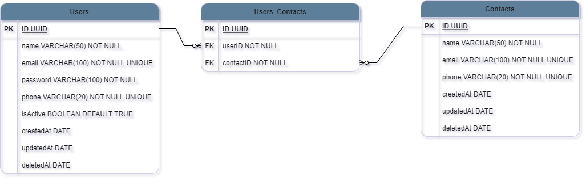

<h1 align="center">Welcome to <strong>Contact Book API!<strong></h1>

This application aims to simulate a contact book. Where the logged in user can register his contacts, list them, update them and delete them.

<h3 align="center">Diagram:</h3>



<h2>Installation</h2>

Para clonar e executar este repositório, você precisará do [Git](https://git-scm.com), do [Node.js](https://nodejs.org/pt-br/download/), do [Yarn](https://classic.yarnpkg.com/lang/en/docs/install/) e do [PostgreSQL](https://www.postgresql.org/download/) instalados em seu computador. \
Na sua linha de comando:

```bash
# Clone este repositório
git clone https://github.com/henriquejesus128/Contact-Book-API.git
# Entre no repositório
cd Contact-Book-API
# Intale as dependências
yarn
# Intancie o banco de dados
yarn typeorm migration:run -d .\src\data-source.ts
# Execute a api
yarn dev
```

- É necessario cria um arquvio .env com as configurações do .env.example.
- Verifique em que PORTA seu Front End e Back End estão pois se tiverem na mesma porta pode não funcinar.

## Documentation

- [Documentation Contact Book API](https://henriquejesus128.github.io/Documentation-Contact-Book-API/)

## Devs who were part of this project:

- [Henrique Jesus](https://www.linkedin.com/in/henrique-jesus128/)
