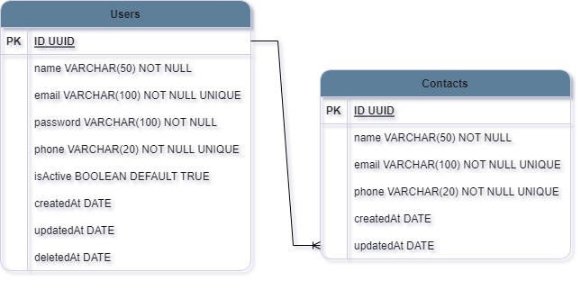

<h1 align="center">Welcome to <strong>Contact Book API!<strong></h1>

This application aims to simulate a contact book. Where the logged in user can register his contacts, list them, update them and delete them.

<h3 align="center">Diagram:</h3>



<h2>Installation</h2>

```bash
  pip install venv
```

Activate on

- Linux: `source venv/bin/activate`
- Windows: `.\venv\Scripts\activate`
- Gitbash: `source venv/Scripts/activate`

Install all dependencies:

```bash
  pip install -r requirements.txt
```

Run the migrations:

```bash
python manage.py migrate
```

## Documentation

- [Last Chapter Documentation](http://127.0.0.1:8000/api/docs/)

## Devs who were part of this project:

- [Henrique Jesus](https://www.linkedin.com/in/henrique-jesus128/)
